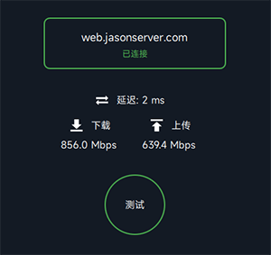

# JQWeb

一些基于WASM的迷你项目，仅供娱乐和供WASM初学者参考

目前只在Qt6.5/Qt6.7版本中进行测试，开发环境是Windows

相比Qt的标准WASM产物，本项目做了以下修改：

* 修改了HTML引导页样式

* 增加了PWA配置

* 加了字体文件，保证中文显示正常

# JQClock

一个时间显示器，格式为 hh:mm:ss

在线访问地址：https://web.jasonserver.com:10035/JQClock/JQClock.html

# JQText

文本显示和输入测试

在线访问地址：https://web.jasonserver.com:10035/JQText/JQText.html

# JQRing

一个旋转的圆圈

在线访问地址：https://web.jasonserver.com:10035/JQRing/JQRing.html

# JQSpeed

一个简易的网络速度测试工具，基于WebSocket连接测试，方便测试局域网/广域网的网络连接质量

在线访问地址：http://web.jasonserver.com:10036/JQSpeed/JQSpeed.html?serverHost=speed.jasonserver.com

